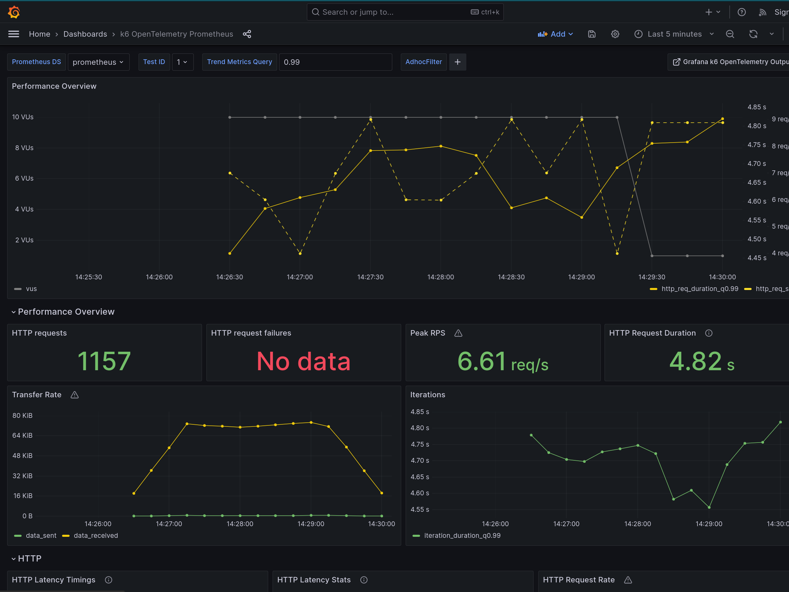

# xk6-output-opentelemetry

A work in progress k6 extension to output real-time test metrics in [OpenTelemetry metrics format](https://opentelemetry.io/docs/specs/otel/metrics/).

> [!WARNING]  
> It's work in progress implementation and not ready for production use.

## Configuration options

Currently, environment variables only. It's worth to mention that the extension is using the [OpenTelemetry Go SDK](https://opentelemetry.io/docs/languages/go/getting-started/) that's why it's possible to use the configuration environment variables from the SDK. However, if the `K6_OTEL_*` environment variables are set, they will take precedence over the SDK configuration.

### k6-specific configuration

* `K6_OTEL_METRIC_PREFIX` - Metric prefix. Default is empty.
* `K6_OTEL_FLUSH_INTERVAL` - How frequently to flush metrics from k6 metrics engine. Default is `1s`.

### OpenTelemetry-specific configuration

* `K6_OTEL_EXPORT_INTERVAL` - configures the intervening time between metrics exports. Default is `1s`.
* `K6_OTEL_EXPORTER_TYPE` - metric exporter type. Default is `grpc`.

#### GRPC exporter

* `K6_OTEL_GRPC_EXPORTER_INSECURE` - disables client transport security for the gRPC exporter.
* `K6_OTEL_GRPC_EXPORTER_ENDPOINT` - configures the gRPC exporter endpoint. Default is `localhost:4317`.

> [!TIP]
> Also, you can use [OpenTelemetry SDK configuration environment variables](https://pkg.go.dev/go.opentelemetry.io/otel/exporters/otlp/otlpmetric/otlpmetricgrpc@v1.26.0).

#### HTTP exporter

* `K6_OTEL_HTTP_EXPORTER_INSECURE` - disables client transport security for the HTTP exporter.
* `K6_OTEL_HTTP_EXPORTER_ENDPOINT` - configures the HTTP exporter endpoint. Default is `localhost:4318`.
* `K6_OTEL_HTTP_EXPORTER_URL_PATH` - configures the HTTP exporter path. Default is `/v1/metrics`.

> [!TIP]
> Also, you can use [OpenTelemetry SDK configuration environment variables](https://pkg.go.dev/go.opentelemetry.io/otel/exporters/otlp/otlpmetric/otlpmetrichttp@v1.26.0).

## Build

To build a `k6` binary with this extension, first ensure you have the prerequisites:

- [Go toolchain](https://go101.org/article/go-toolchain.html)
- Git
- [xk6](https://github.com/grafana/xk6)

```bash
make build
```

This will result in a `k6` binary in the current directory.

## Local usage

1. You could run a local environment with OpenTelemetry collector ([Grafana Alloy](https://github.com/grafana/alloy)), Prometheus backend and Grafana (http://localhost:3000/):

```bash
docker-compose up -d
```

2. Run with the just build `k6:

```bash
 K6_OTEL_GRPC_EXPORTER_INSECURE=true K6_OTEL_METRIC_PREFIX=k6_ ./k6 run --tag testid=1 -o xk6-opentelemetry examples/script.js
 ```

3. Open Grafana http://localhost:3000/ and navigate to the `k6 OpenTelemetry Prometheus` dashboard.


